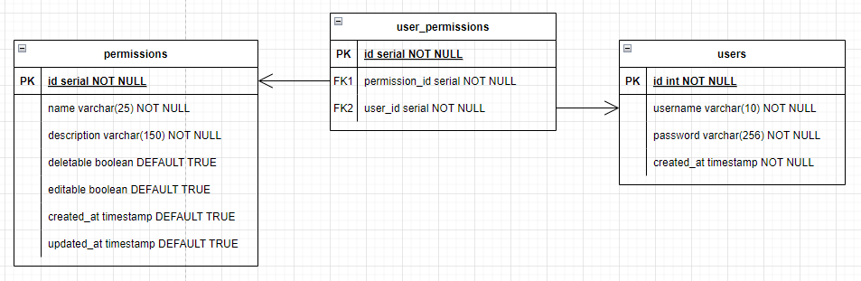

# IAM MeLi

- [Requisitos](#requisitos)
- [Manual](#manual)
  - [Cloud](#cloud)
  - [Arquitectura](#arquitectura)
  - [Base de Datos](#base-de-datos)
  - [Documentación](#documentación)
- [¿Cómo ejecutar sin Docker?](#¿cómo-ejecutar-sin-docker)
- [¿Cómo ejecutar con Docker?](#¿cómo-ejecutar-con-docker)
- [Endpoints](#endpoints)

## [DEMO](http://iam-meli.danielsolarte.co/)

## Requisitos

- *(Opcional)* [Go](https://golang.org/dl/) >=1.11
- *(Opcional)* [PostgreSQL](https://www.postgresql.org/download/) >=9.6
- [Docker](https://www.docker.com/get-started/) >=20.10

## Manual

El API tiene un sistema de autenticación que requiere un registro previo (`/api/auth/signup`), aunque también existe una cuenta de superadministrador que puedes usar para asignar los permisos a los demás usuarios:

```json
{
  "username": "superadmin",
  "password": "superadmin"
}
```

Con el registro o el inicio de sesión obtienes un token de acceso `accessToken` para realizar autenticación mediante Bearer (`Authorization` header), este trae consigo el ID del usuario que generó el token y con este se validará que el usuario posea los permisos para ciertas rutas protegidas.

El sistema cuenta con dos niveles de protección:

1. **Básico**, en este puede entrar cualquier usuario que tenga un token de acceso.

2. **Permisos**, en este pueden entrar únicamente los usuarios que tengan cierto permiso asignado que, dependerá de cada ruta (En la documentación de Swagger se encuentra especificado por ruta).

    > **IMPORTANTE** Es importante tener en cuenta que, para otorgarle un permiso a un usuario o quitárselo, el usuario autenticado debe tener asignado el permiso `grant_permission` o `revoke_permission` respectivamente.

> **NOTA** El usuario autenticado no puede otorgarse o quitarse permisos a si mismo y mucho menos puede eliminar su propia cuenta.

### Cloud

En la parte de la nube, decidí subir el desarrollo a Microsoft Azure por su integración rápida con Docker.

### Arquitectura

#### ¿Por qué Go?

Elegí Go sobre Python puesto que lo conozco más a fondo y quería volver a usar el lenguaje. Incluso, ahora es más fácil hacer módulos que cuando probé el lenguaje por primera vez.

#### ¿Por qué arquitectura hexagonal?

La arquitectura hexagonal permite tener todo agrupado por secciones (servicios, repositorios, modelos, entre otros); en el caso de esta aplicación que tiene solamente 3 módulos internos (autenticación, usuarios y permisos) no es necesario tener agrupado todo por módulo; puesto que, con esta arquitectura se logra una buena legibilidad del código.

### Base de Datos

#### ¿Por qué PostgreSQL?

Decidí esta base de datos por ser relacional; ya que, al ser una aplicación de autorizaciones se tiene una relación estrecha entre los usuarios y los permisos dinámicos.

#### Estructura



#### ¿Por qué la tabla `user_permissions`?

Decidí crear una tabla de relaciones entre los usuarios y los permisos porque estos últimos al ser dinámicos pueden crecer de forma "ilimitada" dando lugar a que una columna dentro de alguna de las tablas fuera desastrozo en temas de búsqueda de permisos de un usuario si tiene cientos.

### Documentación

#### ¿Por qué Swagger?

Swagger tiene una UI/UX intuitiva, fácil de usar y colorida, esto hace que sea mucho más fácil probar el API desde allí sin tener que recurrir a Postman o algún programa parecido.

## ¿Cómo ejecutar sin Docker?

1. Clona el repositorio.

```sh
git clone https://github.com/dsolartec/iam-meli.git
```

2. Compila el proyecto.

```sh
go build ./cmd/iam-meli
```

3. Configura las variables de entorno y ejecutamos el archivo `iam-meli`

```sh
# Linux
DATABASE_URI= JWT_KEY=MeLi2022 PORT=80 iam-meli
```

4. Visita la url `http://localhost:80`

## ¿Cómo ejecutar con Docker?

1. Clona el repositorio.

```sh
git clone https://github.com/dsolartec/iam-meli.git
```

2. Ejecuta el siguiente comando para levantar los contenedores:

```sh
docker compose up
```

3. Visita la url `http://localhost:80`

## Tests

Para ejecutar los tests basta con colocar el siguiente comando en la consola:

```sh
go test ./tests/
```

## Endpoints

Al iniciar la aplicación por cualquiera de los métodos anteriores puedes acceder a la documentación hecha con Swagger ingresando a `http://localhost:80`.

También es posible usar [Insomnia Rest](https://insomnia.rest/download) para ejecutar las peticiones, [aquí](./iam_meli_insomnia.json) se encuentra el documento para importarlo en la aplicación.

## Créditos

- [Daniel Solarte](https://www.danielsolarte.co)
